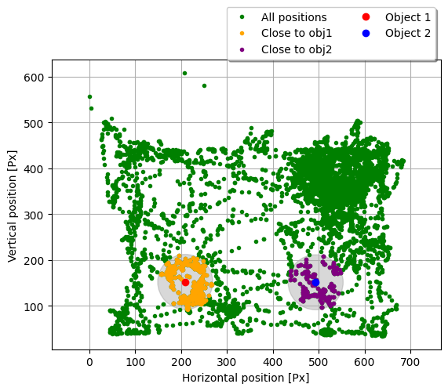
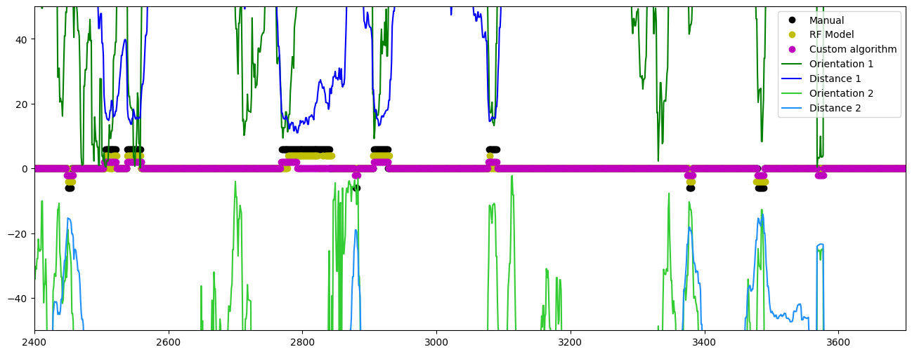
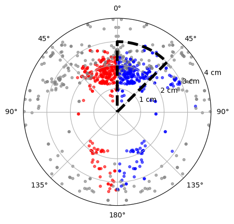

<!-- This is an html comment and this won't appear in the rendered page. You are now editing the "content" area, the core of your description. Everything that you can do in markdown is allowed below. We added a couple of comments to guide your through documenting your progress. -->

## Project definition

## Background

Our project aims to develop different methods for the analysis of behavior in mice (in this case, exploration of an object) to determine which is the best approach to this kind of study. The accurate measurement of these behaviours is crucial for the study of neurodegenerative pathologies, such as Alzheimer’s disease.

We aim to work with and compare three different and increasingly complex methods:

* Manual labeling.
* Motion tracking and data analysis using a custom algorithm.
* Training a Machine Learning algorithm on our labeled data.

### Tools

Our project will rely on the following technologies:

 * Python, to write the scripts used to label and analyze our data.
 * Jupyter Notebooks, to present our results in a clear and readable format.
 * DeepLabCut, to track movements of mice in our videos. The accurate instructions on how to use DLC can be found here https://github.com/DeepLabCut/DeepLabCut

### Data

We worked on videos obtained with C57 mice during a Novel Object Recognition experiment developed at IFIBYNE - UBA, CONICET. The videos were first processed by DeepLabCut pose estimation software.

### Deliverables

At the end of this project, we will have:
 - A script to simplify the manual labeling of videos (including features to quickly label succesive frames by holding down a key and to go back if the user has made a mistake).
 - A Jupyter Notebook where the labeled data and the tracked positions are imported and processed, and where each of our exploration detection methods is applied and compared to the others.
 - A [`requirements.txt`](./requirements.txt) file and the data used during the project, to simplify the reproduction of our results.

## Results

### Progress overview

During the first week, we learned the basic tools which then allowed us to work on our project and collaborate easily: basic Bash commands, Git/GitHub and Python tools for data analysis. In the course of the following weeks, we defined the scope of our project and implemented each of our ideas with the help of our TAs.

### Tools we learned during this project

 * **Proper usage of version control systems for collaboration**: We learned how to properly use Git and Github to simplify collaboration between different team members.
 * We learned how to implement Python scripts to read and process mice positions and label frames.
 * Finally, we managed to use the positions and labels to train a Random Forest model to predict labels on new videos.

### Results

#### Video labeling script

We developed [a script](./Video_Processing/Label_videos.py) to be able to process the video information and label the frames with ease.

#### Motion tracking using DLC

We used Deep Lab Cut to track the positions of different parts of the mice in each of the videos. The resulting data (in `h5` format) can be found under [`Motion_Tracking/DataDLC/videos_eval/`](./Motion_Tracking/DataDLC/videos_eval/).

#### Applying and comparing each method

The most important part of our project is contained in [`exploration_detection.ipynb`](./Motion_Tracking/exploration_detection.ipynb). To start with, we import the labels and the tracked data for each video, and we separate a video to use later to test the model. We then develop our custom algorithm for detecting explorations based on the positions tracked by DLC. This algorithm labels a frame as an exploration if the mouse is both close to a given object and looking at it. In order to determine the proximity and orientation of the mouse, we extract the positions of its nose and its head. We then filter the points where the nose is close to the object and the angle between the head-nose vector and the head-object vector is small. Our code makes use of a series of classes defined in [`Motion_Tracking/utils.py`](./Motion_Tracking/utils.py) to handle the math.

We then use the Random Forest model to process the positions and the given labels, and we test the model on the unseen video, by comparing its detection both to the labels obtained manually, and to those resulting from the distance-orientation algorithm.

The notebook contains a detailed explanation of the process used to import and analyze our data, as well as a description of our custom algorithm and a comparison between the three detection methods.

Some of the plots used to compare the three methods are shown below.

The first shows a time series extracted from the test video, showing that all three methods seem to generally agree on which parts of the video constitute explorations of the different objects, even if they sometimes differ on the predicted length of each exploration event.

Then, in order to compare the distance and orientation of the mouse at the explorations detected by each method, we plot the position of the mouse in each frame using polar coordinates, where the radial coordinate is the distance to object one of the objects, and the angular coordinate is the orientation.

To simplify the comparison between the three detection methods, the region considered for explorations by our custom algorithm is delimited by a dashed line (on the right hand side), and the points are plotted twice: on the left, we highlight the manual detections in red, while on the right, we highlight the Machine Learning algorithm's detections in blue.

We can see that all three methods seem to agree in the region considered for explorations by our custom algorithm, since most points there are also detected by our manual method and by the Machine Learning algorithm.

However, there are several points in the range of angles between $135$° and $180$° where both the manual method and the Machine Learning algorithm detect explorations; this range is not considered by our custom algorithm, which shows its limitations.

## Conclusion
In a video where mice spend approximately 7% of the time exploring, the automatic labeling got 81.7% of the manual labels right (18.3% of false negatives), labeling an extra 17.3% labels wrong (false positives).

In the other hand, the trained random forest model got 90.2% of the manual labels right (leaving 9.8% of false negatives), labeling an extra 11.7% labels wrong (false positives).

## Acknowledgements

We would like to thank our TAs, and Tomás Pastore in particular, for all the help they provided while we were working on our project.

We would also like to thank the BrainHack team for organizing the school and everyone at Humai for hosting the Buenos Aires hub.

## Next steps

In the future, we would like to improve our work by:

- Having several different experimenters create manual labels for each video, in order to reduce experimenter bias.
- Exploring different sets of hyperparameters for our Random Forest model.
- Evaluating our Machine Learning model using a different metric, such as a ROC curve.

